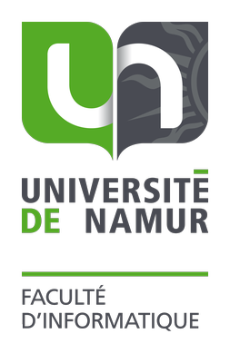

# PhD thesis template for Computer Science Faculty of the University of Namur

## Description

This repository contains a proposed template intended for PhD students writing their doctoral thesis in the Computer 
Science Faculty at the University of Namur.
This template is designed to be plug-and-play.
You only need to follow the instructions and write your content text.
All layout aspects are already set up, but you are free to adapt them.
The template is also well-commented to make its handling and understanding easy.
Finally, the template is accompanied by several examples (e.g., tables, listings, algorithms, SVG images, 
enumeration styles, glossary entry styles, hyphenations, etc.).

[👀 See what it looks like with the PDF preview](Preview.pdf)

## Disclaimer

Keep in mind that this version is a proposal.
This is not an official template that has to be used.
You can use your own template.
Or, you can also adapt this one (see [License](#license)).

## Getting started

Basically, you have two main options:

* You can download the zip file of the source code and upload it on [Overleaf](https://www.overleaf.com/) in a new 
  project.
* Alternatively, you can download the source code and set up your own LaTeX environment on your local host.

Once in the template source code, you can locate and follow the `% TODO` for replacing them with your content.

## Contribute

Contributions are welcome (e.g., bug reports, bug fixes, refactoring, examples, documentation, interesting package 
imports, etc.).

Please use the issues and pull requests mechanisms.

## Frequently Asked Questions

* *Once I've finished my thesis, what should I do?*

  * Once your `thesis_v42_PromoterOK_JuryCheck_AliceBobCorrect_FinalVersion_GoFinal_Done_FINAL_THIS_TIME.pdf` ready, 
    you can contact [Presses Universitaires de Namur (edition.pun@unamur.be)](mailto:edition.pun@unamur.be) by 
    e-mail and explain that you would like to publish your thesis. The entire procedure will then be explained to 
    you in reply to this e-mail. [More information](https://terranostra.unamur.be/pun/Auteur/publications/).
  * At the same time, you will be asked to complete [this form for the BUMP deposit](https://unamur.be/bump/depot-these).
    You can use [this form for extracting the list of your publications](https://www.unamur.be/recherche/pure-1/procedures/publis-format-fnrs) 
    for helping you in completing the "Article" section asking you to reference the list of your publications that are 
    eventually in your thesis.
  
* *What do I need to pay attention to during final proofreading before printing?*

  * During final proofreading, in addition to checking content and spelling, pay attention to layout and colors. 
    Check that no content exceeds the defined margins or is misplaced. Also check that black and white pages do not 
    contain small colored symbols or stylistic elements. Also, don't forget that a color page costs around six times 
    as much as a black-and-white page.
  
* *Do I have to create my own cover page?*

  * No, the cover page follows a template managed by Presses Universitaires de Namur. The only elements you can 
    define are the title, the abstract, a cover photo, a photo of yourself, etc. You will receive exact instructions 
    after contacting them. Pay particular attention to the cover image if you want it to fit perfectly around the 
    edges of the area provided. This area is not a perfect rectangle and looks like a page in an open book, as 
    depicted in the UNamur logo. A wrong image, badly proportioned, badly calibrated, badly centered, badly laid out,
    etc. could lead to poor rendering, illegible, shifted, with undesirable margins, etc. Make sure you choose a 
    suitable image and ask for a print preview to Presses Universitaires de Namur.

## License
                                                                                       
You are free to:                                                                       
   * Share — copy and redistribute the material in any medium or format                
   * Adapt — remix, transform, and build upon the material                             
   * The licensor cannot revoke these freedoms as long as you follow the license       
     terms.                                                                            
                                                                                       
Under the following terms:                                                             
   * Attribution — You must give appropriate credit, provide a link to the license,    
     and indicate if changes were made. You may do so in any reasonable manner, but    
     not in any way that suggests the licensor endorses you or your use.               
   * NonCommercial — You may not use the material for commercial purposes.             
   * ShareAlike — If you remix, transform, or build upon the material, you must        
     distribute your contributions under the same license as the original.             
   * No additional restrictions — You may not apply legal terms or technological       
     measures that legally restrict others from doing anything the license permits.    
                                                                                       
More details: http://creativecommons.org/licenses/by-nc-sa/4.0/                        
                                                                                       
Authors:                                                                               
   * [Fabian Gilson](https://researchportal.unamur.be/fr/persons/fgilson)                                                                 
   * [Nicolas Genon](https://researchportal.unamur.be/fr/persons/nicolas-genon)

Contributors:
   * [Xavier Devroey](https://researchportal.unamur.be/fr/persons/xdevroey)
   * [Tony Leclercq](https://researchportal.unamur.be/fr/persons/tolecler)
   * [Maxime Cauz](https://researchportal.unamur.be/fr/persons/mcauz)
   * [Maxime André](https://researchportal.unamur.be/fr/persons/maxime-andr%C3%A9)
   * ...